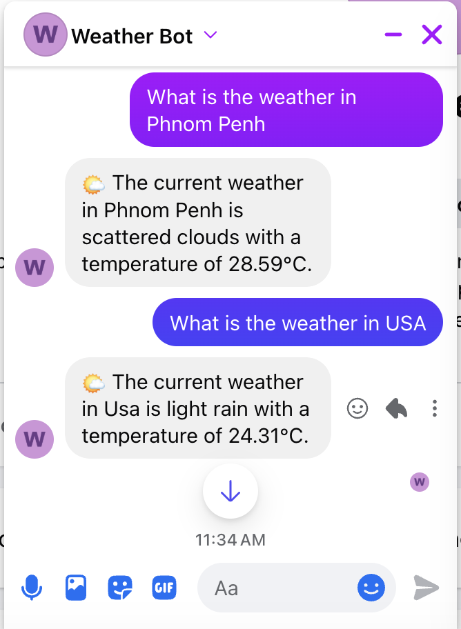
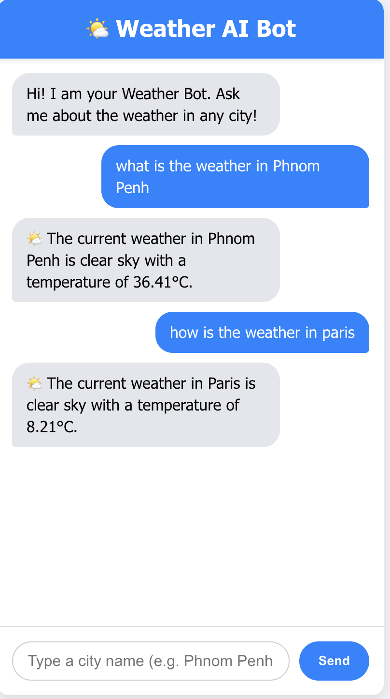

# 🌦️ AI-Powered Weather Chatbot Integration

  <b>An intelligent chatbot that delivers real-time weather updates using AI and natural language processing</b>

  
  
  
  

---

## 📌 Overview

This project is an AI-powered weather chatbot that understands natural language queries and provides real-time weather updates.

Users can ask questions like:

> "What is the weather in Phnom Penh?"

The system processes the request using Dialogflow NLP and retrieves live weather data from OpenWeatherMap API.
It delivers responses through Facebook Messenger or a custom React.js web application.

---

## 🚀 Features

* 🤖 Natural language understanding (NLP)
* 🌍 City-based weather detection
* ☁️ Real-time weather updates
* 💬 Facebook Messenger integration
* 🌐 React.js web interface
* ⚡ Fast and scalable backend

---

## 🏗️ System Architecture

User (Messenger / React App)
↓
Node.js Backend (Webhook)
↓
Dialogflow (Intent + Entity Detection)
↓
OpenWeatherMap API
↓
Formatted Response
↓
User Interface

---

## 🛠️ Technology Stack

### Frontend

* React.js
* HTML5, CSS3

### Backend

* Node.js
* Express.js

### AI / NLP

* Dialogflow (Google Cloud)

### APIs

* Facebook Graph API (Messenger)
* OpenWeatherMap API

### Tools

* Ngrok (local tunneling)
* Postman (API testing)

---

## 🔄 How It Works

1. User sends a message through Messenger or the web app
2. Backend receives the message via webhook
3. Dialogflow processes the message:

   * Detects intent (Weather Inquiry)
   * Extracts entity (city name)
4. Backend calls OpenWeatherMap API
5. Weather data is formatted into a readable response
6. Response is sent back to the user

---

## ⚙️ Installation & Setup

### 1. Clone the repository

git clone https://github.com/SothSokhomal/Weather-Bot-App.git
cd Weather-Bot-App

### 2. Install dependencies

npm install

### 3. Create environment variables

Create a `.env` file and add:

PORT=5000
OPENWEATHER_API_KEY=your_api_key
DIALOGFLOW_PROJECT_ID=your_project_id
FACEBOOK_PAGE_ACCESS_TOKEN=your_token
VERIFY_TOKEN=your_verify_token

### 4. Run the server

npm start

### 5. Expose server using Ngrok (for Messenger webhook)

ngrok http 5000

---

## 📸 Screenshots

### 💬 Messenger Chatbot

### 🌐 React Web App

## 📈 Future Improvements

* 🗺️ Weather map integration
* 🎤 Voice-to-text functionality
* 📊 Extended weather data (humidity, wind speed, forecast)
* 📱 Mobile application version

---

## 🧠 What I Learned

* Building AI chatbot systems using Dialogflow
* Integrating multiple APIs into a single workflow
* Designing scalable backend architecture
* Handling real-world webhook systems

---

## 🤝 Contributing

Contributions are welcome. Feel free to fork this repository and submit a pull request.

